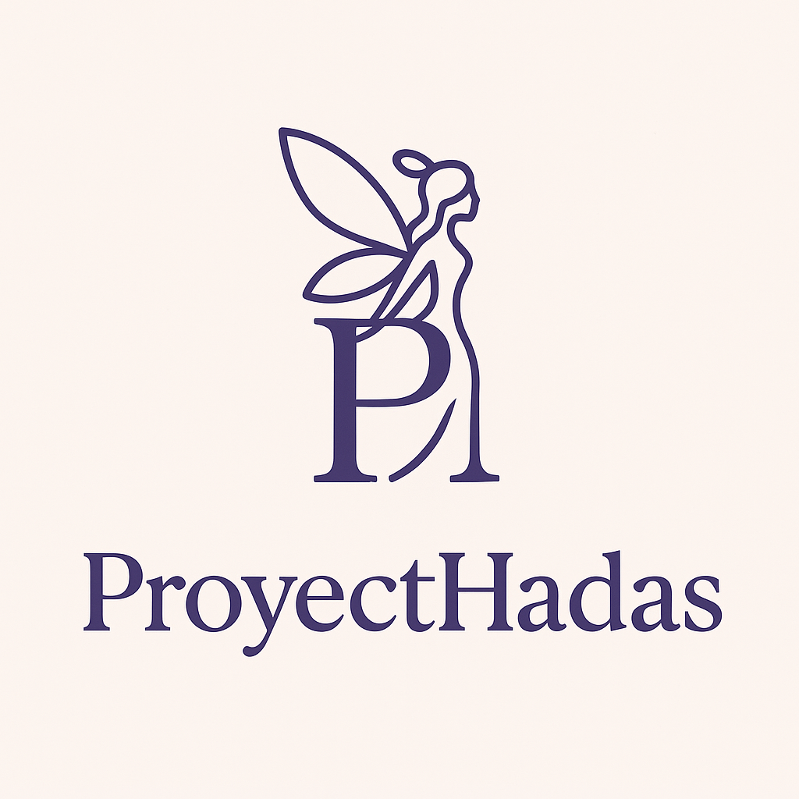

**ProyectHadas** es una aplicación web desarrollada con **React** que permite dar visibilidad a proyectos creados por mujeres en distintos ámbitos profesionales.  
La app permite crear, previsualizar y listar tarjetas de proyectos, incluyendo información de la autora, enlaces a repositorio y demo, e imágenes personalizadas.

---

## Tecnologías utilizadas

- **React** → Librería principal para la creación de componentes reutilizables.  
- **React Router DOM** → Para la navegación entre páginas (Home, DetailPage, etc.).  
- **JavaScript (ES6+)** → Lógica de interacción, gestión del estado y eventos.  
- **HTML5 / JSX** → Estructura semántica y declarativa de la interfaz.  
- **CSS3 / Flexbox / Grid** → Maquetación responsive con un enfoque mobile first.  
- **Vite** → Entorno de desarrollo rápido y optimizado.  
- **LocalStorage** → Almacenamiento temporal de datos de proyectos creados por la usuaria.  
- **PropTypes** → Validación de props entre componentes para mayor robustez.

---

## Funcionalidades principales

- Creación de una **card de proyecto** a través de un formulario.
- Previsualización en tiempo real de la tarjeta (componente `Preview`).
- Carga de imágenes de autora y proyecto.
- Enlaces dinámicos a **GitHub** y **demo** con iconos.
- Página de detalle (`DetailPage`) con información individual de cada proyecto.
- Persistencia local mediante **localStorage**.
- Diseño responsive adaptado a **mobile, tablet y desktop**.
- Estilo visual coherente con la temática: **elegancia, seriedad y confiabilidad**.

---

#### Estructura del proyecto

```plaintext
src/
│
├── components/
│   ├── Header.jsx
│   ├── Footer.jsx
│   ├── Preview.jsx
│   ├── PreviewCard.jsx
│   ├── Form.jsx
│   └── ...
│
├── pages/
│   ├── ListPage.jsx
│   ├── DetailPage.jsx
│   └── NotFoundPage.jsx
│
├── styles/
│   ├── header.css
│   ├── preview.css
│   ├── preview-card.css
│   ├── footer.css
│   └── ...
│
└── App.jsx

```
---
#### Buenas prácticas aplicadas
Componentes funcionales con hooks (useState, useEffect, useParams, useNavigate).

Validación de props con PropTypes.

Nombres de variables y clases semánticos y consistentes.

Código limpio, modular y reutilizable.

Separación clara entre lógica, presentación y estilos.

Uso de placeholders, feedback visual y limitación de caracteres en inputs (maxLength).


---


#### Instalación y ejecución

Clona este repositorio:


git clone https://github.com/Karengonsan/project-promo-55-module-3-team-3

#### Instala las dependencias:


npm install

#### Inicia el servidor de desarrollo:

npm run dev

---

#### Autoras
Irati Aguado, Laura Murray y Karen González
Desarrolladoras Full Stack Junior
